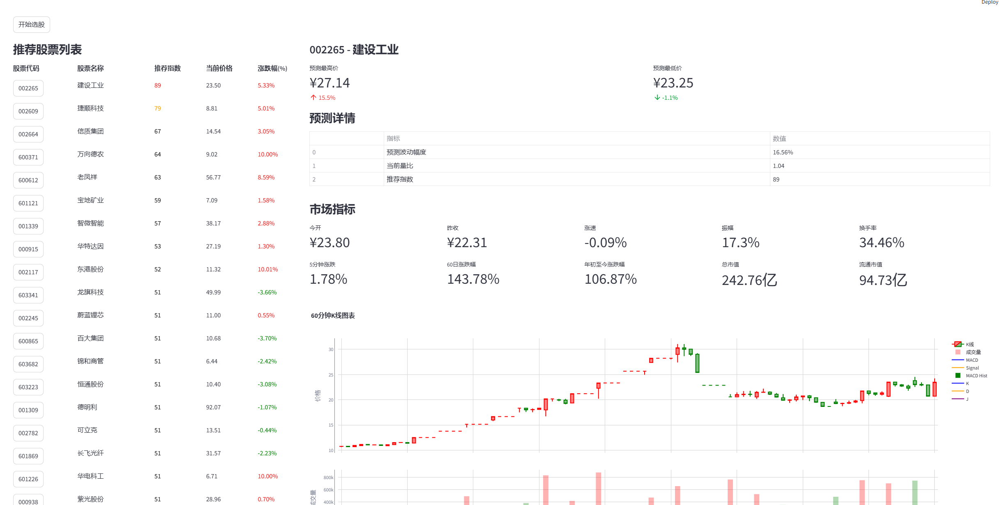

# A股智能选股助手

一个基于 Python 的 A股智能选股工具，使用技术分析和量化交易策略，帮助投资者快速筛选优质股票。

## 系统截图

### 主界面

- 实时市场数据概览
- 智能选股结果列表
- 一键导出Excel功能
- 核心指标面板展示
- 60分钟K线图表
- 技术指标分析（MACD/KDJ）
- 交易量分析
- 多维度技术指标展示
- 智能预测分析
- 市场表现数据

## 功能特点

- 🔍 实时市场数据分析
- 📊 多维度技术指标计算
- 🎯 智能股票筛选推荐
- 📈 K线图表可视化
- 📉 MACD/KDJ等技术指标展示
- 💹 股票预测分析
- 📊 Excel格式导出

## 技术栈

- Python 3.8+
- Streamlit
- Akshare
- TA-Lib
- Plotly
- Pandas
- NumPy

## 安装说明

1. 克隆项目
```bash
git clone https://github.com/yourusername/astock_smart_assistant.git
cd astock_smart_assistant
```

2. 创建虚拟环境
```bash
python -m venv .venv
```

3. 激活虚拟环境
```bash
# Windows
.venv\Scripts\activate

# Linux/Mac
source .venv/bin/activate
```

4. 安装依赖
```bash
pip install -r requirements.txt
```

## 使用说明

1. 启动应用
```bash
streamlit run app.py
```

2. 在浏览器中访问 `http://localhost:8501`

3. 点击"开始选股"按钮，系统将自动分析市场数据并推荐股票

## 主要功能模块

- **市场数据获取**: 实时获取A股市场数据
- **技术指标分析**: 包含MACD、KDJ等多个技术指标
- **智能选股**: 基于多维度分析的股票筛选
- **可视化展示**: K线图表和技术指标图表
- **预测分析**: 股票趋势预测和波动分析
- **数据导出**: 支持Excel格式导出分析结果

## 项目结构

```
astock_smart_assistant/
├── app.py              # 主程序入口
├── stock_screener.py   # 选股策略实现
├── stock_detail.py     # 股票详情分析
├── requirements.txt    # 项目依赖
└── .gitignore         # Git忽略文件
```

## 依赖版本

```
akshare==1.15.59
pandas==2.2.3
ta-lib==0.5.2
numpy==2.2.1
streamlit==1.41.1
streamlit-echarts==0.4.0
plotly==5.18.0
pydantic==1.10.13
openpyxl==3.1.2
```

## 注意事项

- 本工具仅供学习研究使用，不构成任何投资建议
- 使用前请确保已安装TA-Lib库
- 建议使用Python 3.8或以上版本
- 需要稳定的网络连接以获取实时市场数据

## 常见问题

1. TA-Lib 安装失败
   - Windows用户可以在[这里](https://www.lfd.uci.edu/~gohlke/pythonlibs/#ta-lib)下载对应版本的wheel文件安装
   - Linux用户需要先安装ta-lib系统库：`sudo apt-get install ta-lib`

2. 数据获取失败
   - 检查网络连接
   - 确认akshare版本是否正确
   - 可能需要更新akshare token

## 更新日志

### v1.0.0 (2024-12)
- 初始版本发布
- 实现基础选股功能
- 添加技术指标分析
- 支持Excel导出

## 许可证

[MIT License](LICENSE)

## 免责声明

本项目仅供学习和研究使用，不构成投资建议。投资者应当对证券投资风险有充分的了解，并根据自身的投资目标、风险偏好和资产状况做出独立的投资决策。作者对使用本工具所产生的任何直接或间接损失不承担责任。